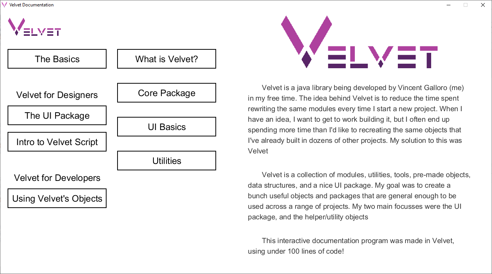

\
\
Developped By: Vincent Galloro
\
\
Velvet is a java Framework / Library for faster application development. Velvet's UI package contains an easy to use, modular, clean set of elements which can be quickly put together into a working application.
\
\
Velvet also contains utility objects such as 2D Vectors, Direction and GridDirection objects, Sprite and Spritesheet objects, and more. A Smooth package which contains SmoothMotion, SmoothColors, and other SmoothTransitions. Velvet also contains some Game Development packages for Entities and Handlers
\
\
The Interactive Documentation program is now live! Simply run the jar file inside the VelvetDocumentation folder for an interactive documentation / tutorial of Velvet's functionality. Some parts of the documentation are still under construction
\
\

